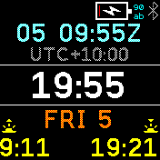
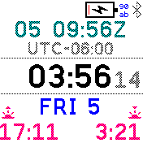

# Avi8or (Aviator) Clock

A clock for aviators, with local time, UTC (incl. offset), date and sun-rise /
sun-set.

## Features

- Local time (with optional seconds)
- UTC / Zulu time
- UTC offset
- Weekday and day of the month
- Sun-rise and sun-set

To toggle the seconds display, double tap the watch from either the left or
right. This only changes the display "temporarily" (ie. it doesn't change the
default configured through the settings).

## Settings

- **Show Seconds**: to conserve battery power, you can turn the seconds display off (as the default)
- **Use My Location**: if the [My Location](?id=mylocation) app is installed, use that location instead of trying to get a GPS fix
- **GPS Update Inteval**: how often (in minutes) to update the location based on GPS (if not using [My Location](?id=mylocation))

## Author

Flaparoo [github](https://github.com/flaparoo)

