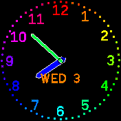

# Colour Analog Clock

This is a colourful analog clock, which also includes the day of the week and
month. The seconds hand can be turned off through the settings, and the style
of the hands can be selected.

It uses hideable widgets.

It is rewrite of [Colorful Analog Clock](?id=colorful_clock).

## Author

Flaparoo [github](https://github.com/flaparoo)

