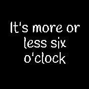
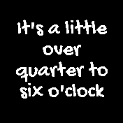
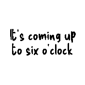

# Fuzzy Clock

Why would you need to know the exact time? Are you working for the military?
Well, even if you do, most of the time it should be sufficient to know the
approximate time. This clock will tell you exactly that (pun intended).

Alright, if you really need to know the precise time, it's only a tap away.

The font is selectable. This clock uses hideable widgets.

It drew inspiration from the [Approximate Clock](?id=approxclock) (and my old
Pebble watch).

## Author

Flaparoo [github](https://github.com/flaparoo)

