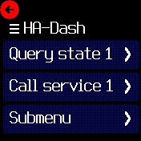

# Home-Assistant Dashboard

This app interacts with a Home-Assistant (HA) instance. You can query entity
states and call services. This allows you access to up-to-date information of
any home automation system integrated into HA, and you can also control your
automations from your wrist.

## How It Works

This app uses the REST API to directly interact with HA. You will need to
create a "long-lived access token", which you will have to configure in this app.

You can then create a menu structure to be displayed on your Bangle, which can
include:

* show the state of a HA entity
* call a HA service
* sub-menus, including nested sub-menus

## Configuration

TBD

## Author

Flaparoo [github](https://github.com/flaparoo)

