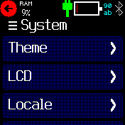

# Another RAM Widget

Show the RAM / flash usage percentage as a widget.

The colour changes if the usage is high (yellow if over 50%, red if over 70%).
The widget is updated every 10 seconds.

## Author

Flaparoo [github](https://github.com/flaparoo)

